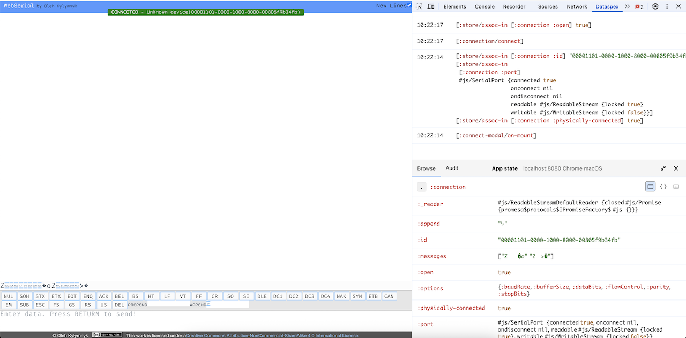

Work in Progress

WebSerial
=========
#### A browser based Serial Port application
#### Ported from https://github.com/williamkapke/webserial into Clojurescript and Replicant




### Huawei Freebuds commands
Noise cancelling on:
```script
+␄␁␁␁
```
Noise cancelling off:
```script
+␄␁␁␀
```
Look for more commands in the original [article](https://mmk.pw/en/posts/freebuds-4i-proto/)

### Tests
Running tests require headless Chrome installed.
```bash
npm run test
```